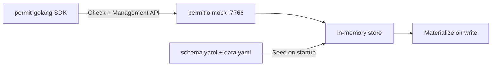
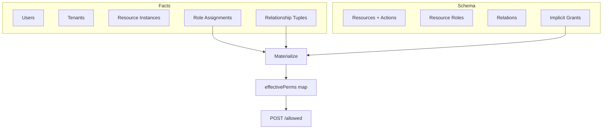

# permitio

Offline mock of the Permit.io PDP and Management API. No cloud connectivity, no valid API key required. Configure via YAML, test with the official Go SDK.

## Why

The official `permitio/pdp-v2` container requires a connection to `api.permit.io` to start. This mock eliminates that dependency for local development, CI, and integration testing.



## How It Works

One binary serves both the PDP check API and the Management API on port 7766. The SDK points both `WithPdpUrl` and `WithApiUrl` at the same host.

ReBAC evaluation uses materialize-on-write: every mutation rebuilds a flat permission map. Check calls are a single map lookup.



## Quick Start

```bash
just docker    # Run on localhost:7766
just ci        # Format, test, lint (local)
just ci-docker # Same checks in Docker (matches GitHub Actions)
```

### SDK Usage

```go
client := permit.NewPermit(
    config.NewConfigBuilder("any-key").
        WithPdpUrl("http://localhost:7766").
        WithApiUrl("http://localhost:7766").
        Build(),
)

// Management API works
client.Api.Tenants.Create(ctx, *models.NewTenantCreate("default", "Default"))
client.Api.Users.Create(ctx, *models.NewUserCreate("user-1"))

// ReBAC checks work
user := enforcement.UserBuilder("user-1").Build()
resource := enforcement.ResourceBuilder("document").WithKey("doc-1").WithTenant("default").Build()
allowed, _ := client.Check(user, "edit", resource)
```

## Configuration

Two optional YAML files loaded from `/config` (container) or `.` (local).

**schema.yaml** defines the policy model:

```yaml
resources:
  - key: folder
    name: Folder
    actions:
      read: { name: Read }
      write: { name: Write }
    roles:
      - key: owner
        permissions: [read, write]
    relations:
      - key: parent
        subject_resource: document

  - key: document
    name: Document
    actions:
      read: { name: Read }
      edit: { name: Edit }
    roles:
      - key: editor
        permissions: [read, edit]

implicit_grants:
  - resource: folder
    role: owner
    on_resource: document
    derived_role: editor
    linked_by_relation: parent
```

**data.yaml** seeds runtime facts:

```yaml
tenants:
  - key: default
    name: Default

users:
  - key: user-1
    email: user@example.com

resource_instances:
  - key: budget
    resource: folder
    tenant: default
  - key: report
    resource: document
    tenant: default

relationship_tuples:
  - subject: "folder:budget"
    relation: parent
    object: "document:report"

role_assignments:
  - user: user-1
    role: owner
    resource_instance: "folder:budget"
    tenant: default
```

Set `mode: allow_all` in schema.yaml to permit everything (useful for initial integration).

## Kubernetes

```bash
helm install permitio ./charts/permitio
```

The Helm chart mounts schema.yaml and data.yaml via ConfigMap at `/config`.

## Differences from Real Permit.io

- No cloud connectivity. All state is in-memory.
- No API key validation. Any bearer token is accepted.
- Single environment. The proj/env path segments are ignored.
- No persistence. State resets on restart (config files reload).
- No pagination. List endpoints return all results.
